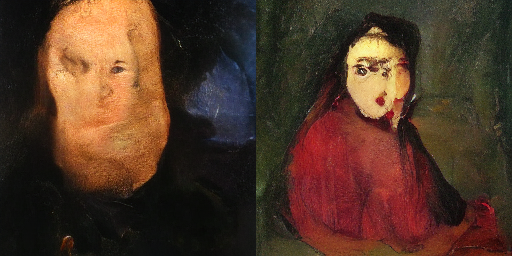
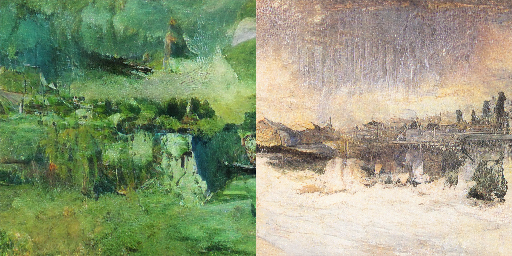
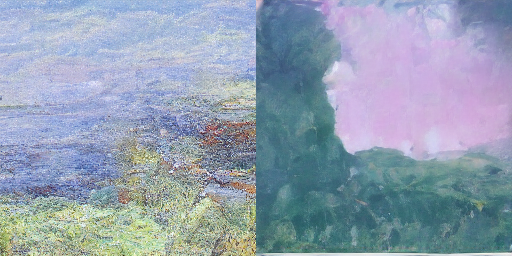
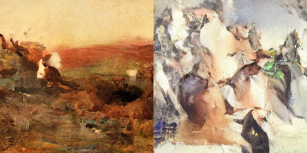

# Latent Diffusion Models for Image Generation (Noise2Art)


## Authors

Rami Matar (rhm2142), Mustafa Eyceoz (me2680), Justin Lee (jjl2245)


## Project Summary

This project explores latent diffusion models introduced in the paper "High-Resolution Image Synthesis with Latent Diffusion Models" by Robin Rombach et. al. (2021) [1]. Diffusion models are generative models that have achieved state of the art results in many image processing tasks [2]. Particularly, we explore the generative power of these models as well as their ability to learn conditional distributions (such as text) [1][6]. The goal of this project is to enable accessible, beautiful art generation (and text-conditional art generation) via latent diffusion models. Through a combination of a VQGAN, Diffusion, a UNet model with self-attention layers, and additional training/transfer-learning techniques, our system can convert any generated small noise pattern (32x32x4) into an artistic image. While small, compact, and fast, the model is able to generate clearly artistic images with little training and cost compared to prior diffusion models. Additionally, users may soon be able to input captions as inspiration for their generated works.

For more details and information, see the project write-up: `report.pdf`

## Approach

- **Training:** By performing transfer-learning on a VQGAN (VQVAE + discriminator) using art-specific datasets, we gain the ability to encode images into a perceptually equivalent (4x32x32) latent space [1]. From there, we add noise via diffusion to the latent embedding, and then pass the noisy latent image into our UNet, whose task is to predict the noise. Loss is calculated based on MSE difference between actual and predicted noise as the simplified loss introduced in the DDPM paper [4]. When noise is predicteed, it can then be removed from our noisy image to retrieve our original latent embedding, and consequently our original image.
- **Use:** Once the UNet is trained, given any compact noise in the latent space, the noise prediction allows us to clean and decode what is left, which is the beatiful art that the UNet has learned to recognize as significant, rather than noise. This allows us to infinitely generate beautiful works with little computational overhead. Additionally, with conditional art generated, these pieces can be guided by the influence of a caption.
- **Dataset:** We use two popular open-source art datasets for our work: WikiArt (for VQGAN transfer-learning and UNet training), and LAION Art (for conditional UNet training)
  - WikiArt: https://huggingface.co/datasets/huggan/wikiart
  - LAION Art: https://huggingface.co/datasets/laion/laion-art

## Usage
Before running any scripts, ensure you have the proper requirements installed
 - `pip install -r requirements.txt`

Additionally, if you are training, you will need to download an appropriate dataset:
 - For huggan/wikiart dataset: ```
    python download_hf.py --dataset_name huggan/wikiart --image_bytes_key image --metadata_columns artist genre style --rows <NUM_SAMPLES> --output_dir wikiart_images --workers <NUM_WORKERS> ```
 - For laion/laion-art dataset: ```
    python download_hf.py --dataset_name laion/laion-art --url_key URL --metadata_columns TEXT WIDTH HEIGHT similarity LANGUAGE hash pwatermark punsafe aesthetic --rows <NUM_SAMPLES> --output_dir laion_art_images --workers <NUM_WORKERS>```

To train your own UNet model, the simplest way is to run the following:
 - `python trainer.py`. Note that all the arguments you can specify can be seen by running `python trainer.py -h`
 - For hyperparameters, checkpoint loading, and other config args, see all options with `python trainer.py <-h>/<--help>`
 - For conditional generation training, use the `--conditional` flag
 - The VQGAN can also be retrained if desired via `python vqgan.py`

To generate sample artworks, simply run the following:
 - `python diffusion.py --unet_ckpt_path <UNET_MODEL>`
 - (Upcoming command to run for conditional)
    
## Showcase





## Primary References

1. Rombach, Robin, et al. "High-resolution image synthesis with latent diffusion models." Proceedings of the IEEE/CVF Conference on Computer Vision and Pattern Recognition. 2022.
2. Dhariwal, Prafulla, and Alexander Nichol. "Diffusion models beat gans on image synthesis." Advances in Neural Information Processing Systems 34 (2021): 8780-8794.
3. Esser, Patrick, Robin Rombach, and Bjorn Ommer. "Taming transformers for high-resolution image synthesis." Proceedings of the IEEE/CVF conference on computer vision and pattern recognition. 2021.
4. Ho, Jonathan, Ajay Jain, and Pieter Abbeel. "Denoising diffusion probabilistic models." Advances in Neural Information Processing Systems 33 (2020): 6840-6851.
5. Nichol, Alexander Quinn, and Prafulla Dhariwal. "Improved denoising diffusion probabilistic models." International Conference on Machine Learning. PMLR, 2021.
6. Ho, Jonathan, and Tim Salimans. "Classifier-free diffusion guidance." arXiv preprint arXiv:2207.12598 (2022).
